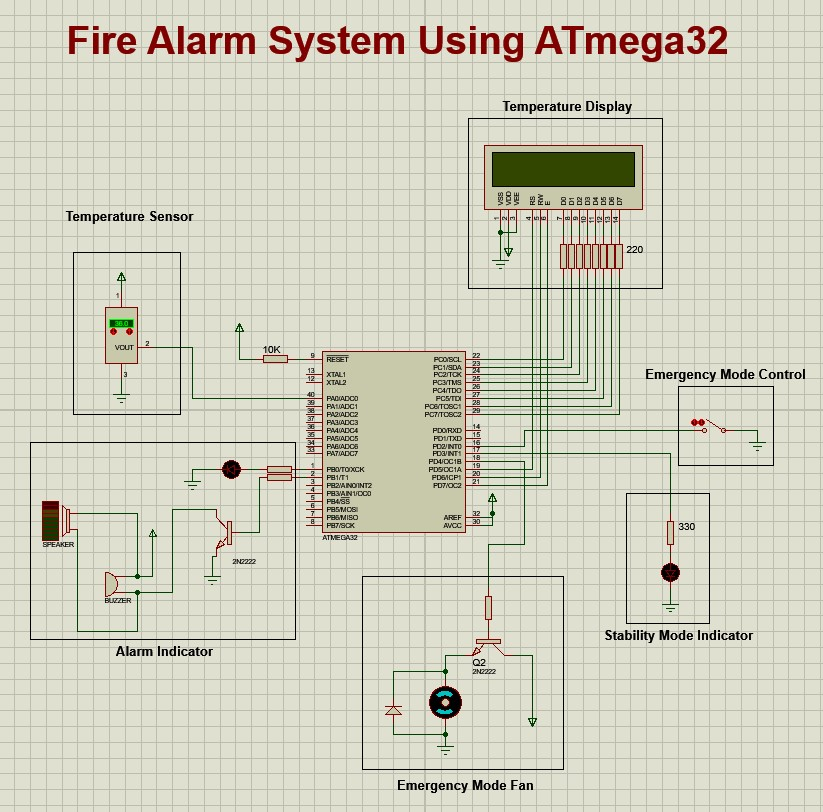
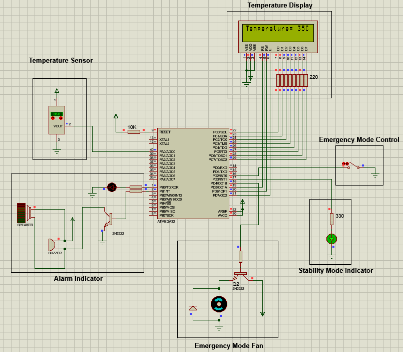
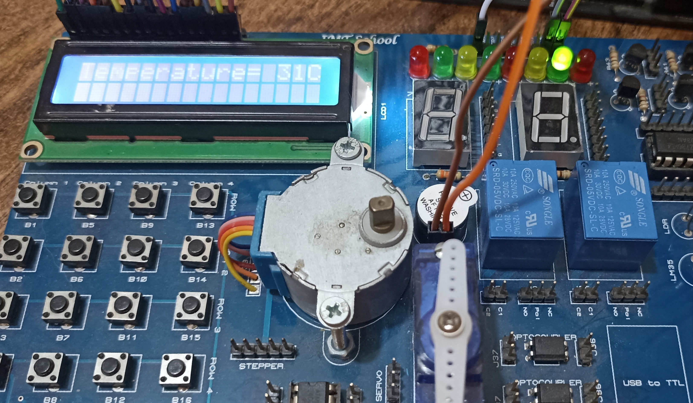
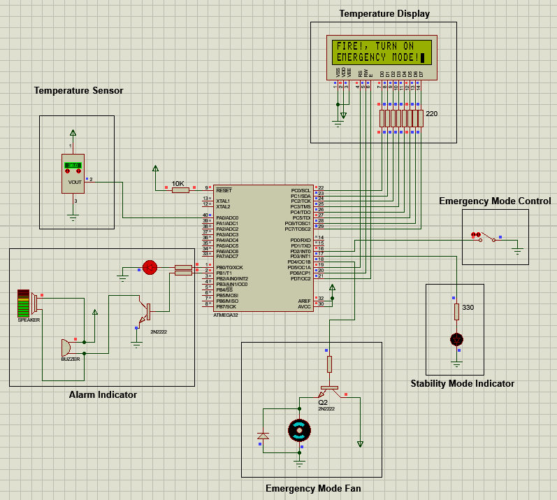
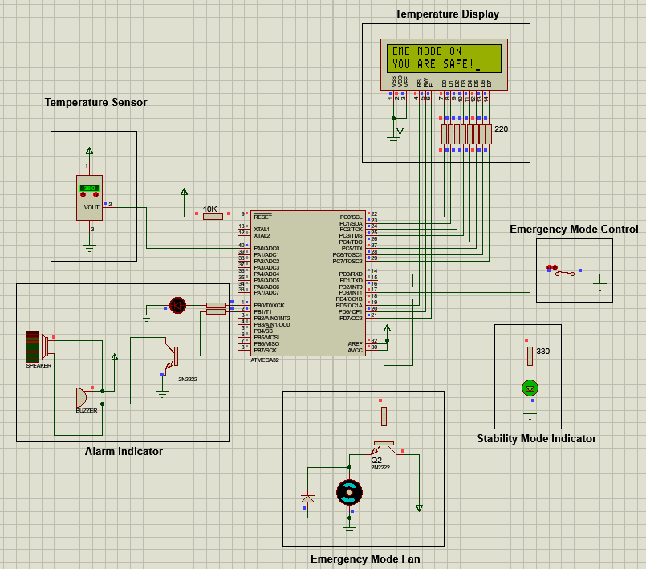
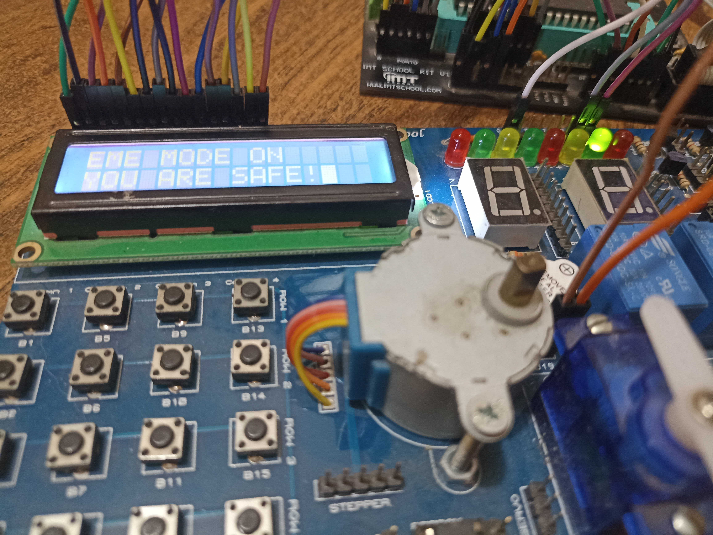

<!-- PROJECT TITLE -->
<h1 align="center">"Fire Alarm System Using ATmega32"</h1>

<!-- OVERVIEW -->
## <br>**➲ Overview**
This project is designed to create a Fire Alarm System using an ATmega32 microcontroller. The system incorporates a temperature sensor (LM35), an LCD for displaying temperature and system status, a red LED and a buzzer for alarm signaling, a green LED to indicate system stability, a DC motor on Port D Pin 4 to act as a fan for cooling, and a switch to control the emergency mode. The system is designed to monitor the temperature, raise alarms when the temperature exceeds a predefined threshold, and provide a manual emergency mode for user intervention.

The following images show screenshot of full system hardware connection and simulation.




<!-- HARDWARE REQUIREMENTS -->
## <br>**➲ Hardware Requirements**
* IMTSchool Development Kit (or a compatible hardware setup)
* USBASP Programmer (or another suitable programmer)
* Jumper wires

<!-- SOFTWARE REQUIREMENTS -->
## <br>**➲ Software Requirements**
* <a href="https://www.eclipse.org/downloads/packages/release/2023-06/r/eclipse-ide-cc-developers" target="_blank">Eclipse IDE</a> 
* <a href="https://www.labcenter.com/downloads/" target="_blank">Proteus</a> 
* <a href="https://sourceforge.net/projects/winavr/" target="_blank">WinAVR</a> 
* <a href="https://www.fischl.de/usbasp/" target="_blank">USBASP driver</a> 

**NOTE:** you can install another simulation program like multisim and another IDE like Microship studio or VS code with external compiler, anything can work all you need is to compile the project to generate hex file.

<!-- PROJECT STRUCTURE -->
## <br>**➲ Project Structure**
The project is structured as follows:
* main.c: The main application code responsible for counting and controlling the LEDs based on the 7-segment display's value.
* STD_TYPES.h: A header file containing standard data types for the project.
* BIT_MATH.h: A header file containing bit manipulation macros.
* DIO Driver:
  * DIO_Program.c: The source code for the DIO driver functions.
  * DIO_Interface.h: The interface (header) file for the DIO driver.
  * DIO_Register.h: Registers addresses for the DIO driver.
* LCD Driver:
  * LCD_Program.c: Implementation of the LCD driver.
  * LCD_Interface.h: Interface for the LCD driver.
  * LCD_Config.h: Configuration file for LCD settings.
* EXTI Driver:
  * EXTI_Program.c: Implementation of the External Interrupt (EXTI) driver.
  * EXTI_Interface.h: Interface for the EXTI driver.
  * EXTI_Register.h: Register addresses for EXTI.
  * EXTI_Config.h: Configuration file for EXTI settings.
* ADC Driver:
  * ADC_Program.c: The source code for the ADC driver functions.
  * ADC_Interface.h: The interface (header) file for the ADC driver.
  * ADC_Register.h: Registers addresses for the ADC driver.

<!-- GETTING STARTED -->
## <br>**➲ Getting Started**
1. **Hardware Setup:**
   * Connect the full system using ATmega32 microcontroller.

2. **Software Setup:**
* Install Eclipse on your computer.
* Set up Proteus for simulation.
* Install the USBASP Programmer software and ensure your programmer is connected.
1. **Clone the Repository:**
```sh
git clone https://github.com/omaarelsherif/Fire-Alarm-System-Using-ATmega32.git
```
1. **Build the project:**
   * Build the project using Eclipse or any another IDE
   * Use the USBASP Programmer to flash the ATmega32 with the generated hex file.
2. Run the Simulation:
   * If you want to simulate the project, open it in Proteus and run the simulation.
3. Observe the system:
   * Observe thye change in temperature and try emergency mode.

<!-- SYSTEM BEHAVIOR -->
## <br>**➲ System Behavior**
<h4>Normal State (Temperature <= 35°C)</h4>
When the temperature is less than or equal to 35°C:
* The LCD displays the current temperature.
* The green LED on Port D Pin 3 is turned on to indicate system stability.
* The DC motor (fan) on Port D Pin 4 remains off.
  
The following images show screenshot of system hardware connection and simulation in normal state.




<h4>Alarm State (Temperature > 35°C)</h4>
When the temperature exceeds 35°C:
* The LCD displays a warning message, instructing the user to turn on the emergency mode.
* The green LED on Port D Pin 3 is turned off to indicate an unstable state.
* The red LED and the buzzer on Port B Pin 0 and Pin 1 are turned on to raise an alarm.
* The DC motor (fan) on Port D Pin 4 remains off.
  
The following images show screenshot of system hardware connection and simulation in normal state.




<h4>Emergency State</h4>
The system provides a manual emergency mode control using an external switch connected to INT0.
When the switch is triggered (pressed or locked), the Interrupt Service Routine (ISR) associated with INT0 is fired.
In the emergency mode:
* The LCD displays a message indicating that the emergency mode is active, and the user is safe.
* The green LED on Port D Pin 3 is turned back on to indicate system stability.
* The red LED and the buzzer on Port B Pin 0 and Pin 1 are turned off to stop the alarm.
* The DC motor (fan) on Port D Pin 4 is turned on, acting as a cooling fan to lower the temperature.

The following images show screenshot of system hardware connection and simulation in normal state.




<!-- CONTACT -->
## <br>**➲ Contact**
- E-mail   : [omaarelsherif@gmail.com](mailto:omaarelsherif@gmail.com)
- LinkedIn : https://www.linkedin.com/in/omaarelsherif/
- Facebook : https://www.facebook.com/omaarelshereif
